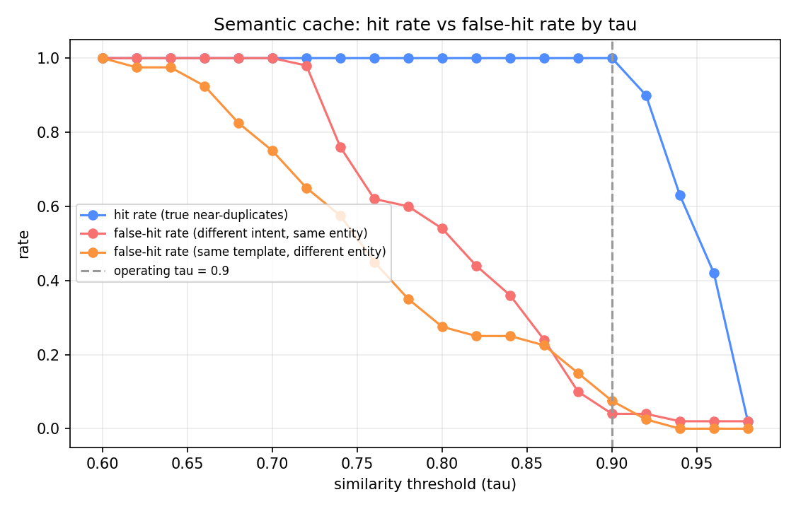
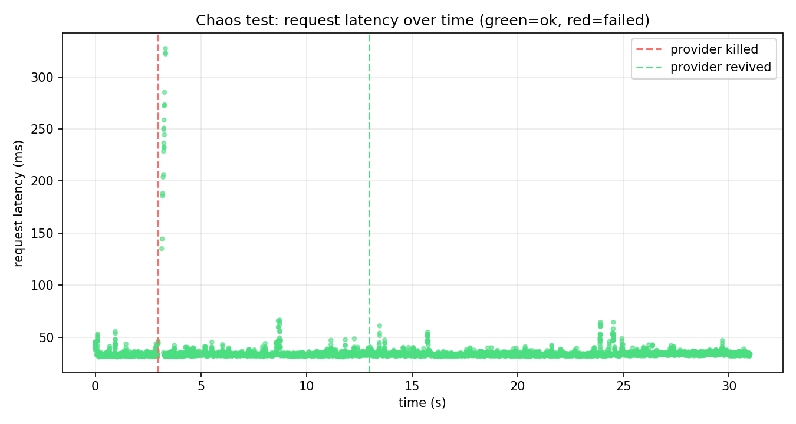
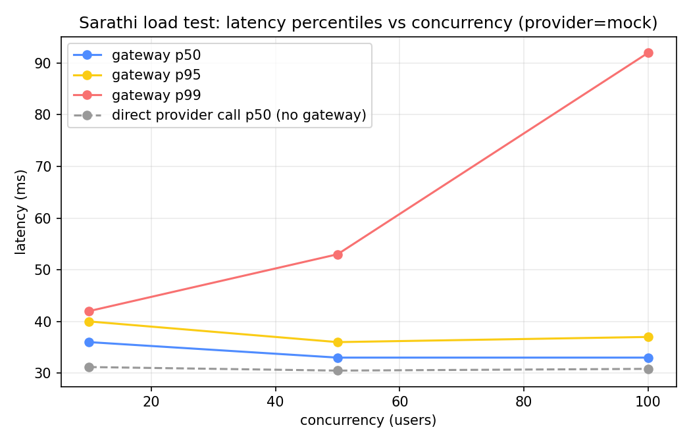

# Sarathi (सारथी)

**Self-hostable, OpenAI-compatible LLM gateway: cut inference cost with a
verified two-tier semantic cache and complexity-based routing, survive
provider outages with circuit breakers and failover, and meter cost,
latency, and quality per key/model/day.**

*Sarathi = charioteer — it steers every request your AI products make.*

[](https://github.com/<your-org>/sarathi/actions/workflows/ci.yml)
[](https://github.com/<your-org>/sarathi/actions/workflows/canary.yml)

> Replace `<your-org>/sarathi` above with the real GitHub path once this
> repo is pushed — the badges will start rendering from the first CI run.

One line to switch any OpenAI-compatible app over:

```diff
- client = OpenAI(base_url="https://api.openai.com/v1")
+ client = OpenAI(base_url="https://<your-sarathi-deploy>/v1", api_key="sk-...")
```

---

## Why this exists

Every product built on LLM APIs runs into the same three problems in 2026:

1. **Cost** — apps route every request to the biggest model "to be safe,"
   even though most real traffic (lookups, classification, rephrasing,
   near-duplicate questions) would get an identical answer from a model
   10–30x cheaper.
2. **Reliability** — providers rate-limit, time out, and go down. An app
   wired straight to one provider inherits that provider's downtime.
3. **Blindness** — nobody can answer "what did this feature cost
   yesterday" or "which key is about to blow its budget" because calls
   go straight from app code to provider SDKs with nothing in between.

Sarathi is the layer in between: one gateway that caches, routes,
survives failures, and meters everything — and publishes the evidence
for every claim it makes, including the ones that didn't work
perfectly (see [Limitations](#limitations)).

---

## Request lifecycle

```
  Client apps (anything OpenAI-compatible)
         |  POST /v1/chat/completions  +  API key
         v
 +-----------------------------------------------+
 | 1. Auth & governance                          |
 |    key check . per-key budget . rate limit    |
 +---------------------+---------------------------+
                       v
 +-----------------------------------------------+   hit
 | 2. Semantic cache                             |--------> return cached
 |    exact hash -> embedding sim >= tau           |          (metered, logged)
 +---------------------+---------------------------+
                       | miss
                       v
 +-----------------------------------------------+
 | 3. Router                                     |
 |    complexity features -> model tier           |
 |    modes: cost-first . quality-first . pin    |
 +---------------------+---------------------------+
                       v
 +-----------------------------------------------+
 | 4. Provider layer                             |
 |    adapters: Groq . Gemini . mock             |
 |    retries+backoff . timeout budgets          |
 |    circuit breakers . failover chains         |
 |    SSE streaming passthrough                  |
 +---------------------+---------------------------+
                       v
 +-----------------------------------------------+
 | 5. Response path                              |
 |    validate -> cache write -> meter tokens x Rs|
 +---------------------+---------------------------+
                       v
                    client

 Side planes:  /dashboard (embedded HTML, reads the metering DB)
               canary evals (GitHub Actions, nightly)
               Locust load tests + chaos-injection admin API
```

---

## Quickstart (zero credentials)

```bash
git clone <this-repo> && cd sarathi
python3.11 -m venv .venv && source .venv/bin/activate
pip install -r requirements.txt
uvicorn gateway.api.main:app --reload
```

```bash
curl http://localhost:8000/v1/chat/completions \
  -H "Authorization: Bearer sk-local-dev" \
  -H "Content-Type: application/json" \
  -d '{"messages":[{"role":"user","content":"What is the capital of France?"}]}'
```

That's it — LOCAL mode runs entirely against a built-in mock provider with
SQLite storage and in-memory rate limiting. Open `http://localhost:8000/dashboard`
to watch cost, latency, cache hit rate, and breaker state update live.
LIVE mode (real Groq/Gemini, Supabase, Upstash, Render) is a `.env` away —
see `.env.example` and `docs/HUMAN_TASKS.md`.

Docker: `docker build -t sarathi . && docker run -p 8000:8000 sarathi` (builds
and boots clean — see [Verification](#what-was-actually-run)).

---

## The five benchmark tables

**Every number below was produced by a script in `benchmarks/` writing to
`results/`, and every artifact says which provider generated it.**
Nothing here is hand-typed. Where a number is `provider=mock` — because
this was built and verified with zero API credentials — the exact caveat
is quoted from the results file, not smoothed over. The one supervised
LIVE session (real Groq/Gemini traffic) is tracked as a pending step in
`docs/HUMAN_TASKS.md`; re-running the same scripts with `.env` populated
regenerates every table below against real models.

### 1. Cost — `results/cost/cost_report_mock.json`

1,000 synthetic support-style requests (45% from a 40-prompt FAQ-like
"hot" subset, the rest from the full 500-prompt labeled routing dataset),
replayed once against an always-large baseline and once through Sarathi.

| | Rs / 1,000 requests |
|---|---|
| Direct-to-large baseline | 2.037 |
| Through Sarathi | 0.052 |
| **Savings** | **97.5%** |
| — from cache (92.5% hit rate) | 1.876 |
| — from routing (small/mid instead of large) | 0.109 |

`provider=mock`: token counts and the pricing table are real (see
`gateway/metering/pricing.py`, sourced from public Groq/Gemini list
prices), but the responses themselves are mock-generated, and traffic is
synthetic support-style prompts, not real SupportMind 2.0 logs.

### 2. Quality parity — `results/routing/parity_mock.json`

Router validated offline against 500 labeled prompts
(`benchmarks/replay/routing_dataset.jsonl`) *before* cost-first routing
was enabled, per the project's hard rule: no policy ships without parity
evidence.

| | |
|---|---|
| Router tier accuracy vs. labels | 89.2% |
| Routed-down requests (eligible for parity check) | 422 / 500 |
| Parity (win+tie vs. large tier) | 100%, target ≥90% |

`provider=mock`: the mock provider returns the same canned reply
regardless of tier (it only echoes word count), so candidate and
reference text are byte-identical and 100% parity here is a property of
the harness, not evidence of real quality parity — that requires the
LIVE session. `judge_mode=heuristic_fallback` (embedding similarity)
throughout, since there's no real large-tier model to act as an LLM
judge without credentials.

### 3. Cache — `results/cache/tau_sweep.json` + `tau_sweep.png`



50 clusters of (canonical prompt, true near-duplicate paraphrases,
confusable-but-different prompts), swept across similarity thresholds.

| tau | hit rate | false-hit rate (diff. intent) | false-hit rate (diff. entity) |
|---|---|---|---|
| 0.86 (naive default) | 100% | 24% | 22.5% |
| **0.90 (operating, chosen from this chart)** | **100%** | **4%** | **7.5%** |
| 0.94 | 63% | 2% | 0% |

The operating threshold was moved from an initial guess of 0.86 to 0.90
*because of this chart* — same hit rate, false-hit rate down 6x. See
[Limitations](#limitations) for the entity-collision false-hit mode this
chart surfaced and doesn't fully solve.

### 4. Reliability — `results/chaos/chaos_test.json` + `chaos_test.png`



20 concurrent workers hit the gateway continuously for 31s. After a 3s
warmup, the primary provider in the chain was killed via
`POST /admin/chaos` for 10s, then revived, with 18s observed for breaker
recovery. `SARATHI_DEMO_MODE` registers a second mock-backed adapter so a
real two-provider failover chain exists without any credentials — the
failover/breaker/retry code under test is the actual production path.

| | |
|---|---|
| Total requests | 7,295 |
| Failed requests | **0** |
| Availability | **100%** |
| Requests during the 10s outage | 2,316 |
| Failed during the outage | **0** |
| Requests that failed over to the healthy provider | 3,588 |
| Avg latency (overall / during outage) | 34.7ms / 35.7ms |

This run is also the reason `gateway/providers/breaker.py` looks the way
it does — see [Limitations](#limitations).

### 5. Load — `results/load/load_test.json` + `load_test.png`



Locust, headless, 12s per concurrency level, `temperature=0.7`
(non-cacheable) prompts so this measures the real per-request compute
path, not cache hits.

| concurrency | p50 | p95 | p99 | req/s | failures | gateway overhead (p50 vs. direct call) |
|---|---|---|---|---|---|---|
| 10 | 36ms | 40ms | 42ms | 48 | 0 | +4.8ms |
| 50 | 33ms | 36ms | 53ms | 243 | 0 | +2.5ms |
| 100 | 33ms | 37ms | 92ms | 482 | 0 | +2.2ms |

Auth, cache lookup, routing, and metering together add roughly **2–5ms**
on top of the underlying model call.

---

## Design decisions

**Why OpenAI-compatible?** Adoption is a `base_url` swap, proven by the
one-line diff at the top of this README.

**Why measure cache false-hits, not just hit rate?** A cache that returns
*wrong* answers is worse than no cache. The tau-sweep chart above exists
specifically so the false-hit rate is never hidden behind a headline hit
rate — and running it for real surfaced a false-hit mode (same template,
different entity — "capital of France" vs. "capital of Japan") that a
hit-rate-only view would have missed entirely. See Limitations.

**Why offline router validation before enabling a policy?** Never ship a
routing policy you haven't scored. `results/routing/parity_mock.json`
exists before cost-first mode runs any real traffic, and the same
500-prompt dataset is the regression asset for every future policy
change.

**Why circuit breakers, not just retries?** Retrying a genuinely dead
provider burns the whole request's latency budget on doomed attempts.
This is also the project's best "I found a real bug" story: the first
breaker implementation used a time-based window, and under the sustained
traffic in the chaos benchmark, hundreds of pre-outage successes sat in
that window and diluted the failure ratio enough that the breaker never
tripped during a 10-second outage — visible directly in
`results/chaos/chaos_test.png` before the fix (a latency plateau for the
full outage instead of a brief spike). Switched to a fixed-size,
count-based sliding window (the standard resilience4j/Hystrix approach)
and the same benchmark now shows the breaker opening in about a second,
regardless of how much traffic preceded the outage —
`tests/test_breaker.py::test_breaker_ignores_stale_successes_outside_the_window`
is the regression test for exactly this.

**Why chaos testing?** Reliability claims without failure injection are
vibes. `POST /admin/chaos` (admin-token gated) is the same mechanism
behind the automated benchmark and the manual on-camera demo recipe in
`docs/HUMAN_TASKS.md`.

**Why not just use LiteLLM or Portkey?** Because the internals those
tools abstract away — tau-sweeps, parity scoring, breaker behavior under
sustained load, the buffered mid-stream-failover policy — are precisely
the engineering this project is meant to demonstrate. Importing a gateway
teaches you the API; building one teaches you why the API looks that way.

---

## Reliability details worth knowing

- **Streaming mid-death policy.** If a stream dies before
  `stream_fallback_token_threshold` (8) tokens have been buffered, the
  gateway silently retries the next provider in the chain — the client
  never sees it, because those tokens were never flushed. Past that
  point, the response is already partially in the client's hands, so a
  graceful `mid_stream_error` is surfaced instead of a duplicated or
  corrupted answer. Tested in `tests/test_failover.py` with deterministic
  chaos flags (`die_mid_stream_after_tokens`), not real network timing.
- **Every request writes exactly one metering record** — hit, miss,
  failover, or error — enforced by routing every response path through
  `gateway/metering/writer.py::record_usage`.
- **Never cache above `temperature=0.3`, never cache across API-key
  namespaces**, and cache writes only happen after a response has
  already been validated.

---

## Repo structure

```
sarathi/
|-- gateway/
|   |-- api/            openai-compatible routes, sse streaming, /dashboard, admin+chaos API
|   |-- auth/           keys, budgets, rate limits (in-memory + Upstash)
|   |-- cache/          exact + semantic tiers, embeddings
|   |-- router/         features, heuristic classifier, policy engine
|   |-- providers/      adapters (groq, gemini, mock), breaker, failover, errors.py
|   |-- metering/       usage records, pricing tables
|   `-- storage/        sqlite / supabase adapters behind one interface
|-- policies/           routing.yaml, failover.yaml
|-- canary/             probe_set/, judge.py, run_canary.py
|-- benchmarks/         cost_report.py, tau_sweep.py, locust/, chaos/, replay/, cache/
|-- results/            every number above, generated by the scripts in benchmarks/
|-- docs/               BLUEPRINT.md, PLAN.md, HUMAN_TASKS.md, supabase_schema.sql
|-- tests/               37 tests: streaming, failover, chaos injection, cache, router, breaker
|-- Dockerfile / render.yaml
`-- .github/workflows/  ci.yml, canary.yml (nightly, skips cleanly without secrets)
```

---

## What was actually run

Not claims — things executed in this environment, with results checked in:

- `pytest -q` — **37 passed**, covering streaming + non-streaming
  completions, exact/semantic cache hits, router tier decisions, circuit
  breaker state transitions, failover across providers, mid-stream chaos
  injection, and Groq/Gemini adapter error-taxonomy mapping (mocked HTTP,
  no real credentials).
- `ruff check . && ruff format --check .` — clean.
- `docker build -t sarathi .` — builds and boots; `/healthz` and
  `/v1/chat/completions` verified against the built image.
- Every script in `benchmarks/` and `canary/run_canary.py` — run for
  real against the mock provider; `canary/run_canary.py` specifically
  verified to skip cleanly (exit 0, `status: skipped`) with no
  credentials configured, which is what it will do in CI until Groq/Gemini
  secrets are added.

---

## Limitations

Said plainly, because a project that only lists its wins isn't finished:

- **No real model has answered a request in this repo yet.** Every
  number above is `provider=mock`, run with zero credentials by design
  (see `docs/BLUEPRINT.md` §3, the local-first design). The one
  supervised LIVE session, the Render deploy, and pointing a real client
  at this gateway are tracked in `docs/HUMAN_TASKS.md` and are not done.
- **The semantic cache has a known false-hit mode.** At the operating
  threshold (tau=0.90), ~7.5% of "same template, different entity"
  prompts (e.g. "capital of France" vs. "capital of Japan") still collide,
  because embedding similarity is dominated by template structure over
  the one varying token. Raising tau further trades away real hit rate
  (same chart). A proper fix needs an entity-aware guard, not just a
  threshold — tracked in `FUTURE.md`.
- **The router is a hand-weighted heuristic, not a learned classifier**
  (length, code/reasoning-signal regexes, message depth — see
  `gateway/router/classifier.py`). It was calibrated against the
  500-prompt labeled dataset and generalizes to that dataset's patterns;
  real traffic will likely need threshold recalibration using the same
  `benchmarks/replay/routing_eval.py` harness.
- **Rate limiting is in-memory in LOCAL mode** (per-process, resets on
  restart); the Upstash-backed implementation exists
  (`gateway/auth/ratelimit.py::UpstashRateLimiter`) but is untested
  against a real Redis instance.
- **Cost numbers use public list pricing** (`gateway/metering/pricing.py`,
  assumed USD/INR=83), not an actual invoice — Groq and Gemini are used
  here on free tiers, so real spend in this repo's testing was Rs0.
- **The dashboard has no auth of its own** beyond whatever network
  boundary it's deployed behind — fine for a single-operator demo, not
  for a multi-tenant product.
- **Single-process only.** No multi-instance coordination beyond what
  Supabase/Upstash already provide in LIVE mode; horizontal scaling,
  hedged requests, and multi-region are explicitly out of scope for v1
  (see `FUTURE.md`).
- **`SARATHI_DEMO_MODE` is a demo-only knob.** It fills an *unconfigured*
  provider slot with a mock stand-in so failover chains are exercisable
  without credentials; nothing currently stops it from being left on
  alongside real LIVE keys, so deploys should confirm it's unset.

"Production-grade" appears nowhere in this README unless CI and tests
back it — and where they don't (LIVE traffic, the deploy, the video),
that's said directly above, not implied away.

---

## Roadmap

See `FUTURE.md` for what's explicitly deferred (entity-aware cache guard,
hedged requests, multi-region, additional provider adapters, learned
router classifier) and `docs/HUMAN_TASKS.md` for what's blocked on a
human action rather than more engineering.
